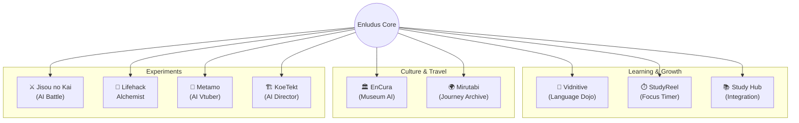

# Enludus 🚀

  

  <b>「学びを冒険に。壁を、扉に。」</b> 
  Merging Education & Technology into Adventure.

  
  

---

## 🌐 Website

**[https://enludus.vercel.app/](https://enludus.vercel.app/)**

## 🎯 Mission

既存の教育や学習ツールの「壁」を打ち破り、学ぶこと自体を楽しい冒険に変えるプロダクト群を開発しています。
**"Enludus"** は "Enlightenment (啓蒙)" + "Ludus (遊び)" を掛け合わせた造語です。

---

## 🌌 The Ecosystem

Enludusプロジェクトは、それぞれのアプリが独立しながらも「知の探究」というテーマで繋がっています。

---

## 📦 Projects

### ✅ Released / Beta

| Project | Description | Tech Stack | Link |
|:--------|:------------|:-----------|:-----|
| **EnCura** | AI学芸員と巡る美術館ガイド | `Flutter` `Supabase` `Gemini` | App Store |
| **StudyReel** | 学習の瞬間を記録するタイマー | `Swift` `SwiftData` `WidgetKit` | [App Store](https://apps.apple.com/jp/app/studyreel/id6756177589) |
| **Vidnitive** | YouTube×AIの語学学習PF | `Next.js` `Gemini` `Capacitor` | [Web App](https://my-language-dojo-l8cl.vercel.app/) |
| **Mirutabi** | ルート共有型・旅行SNS | `Next.js` `Mapbox` `Go` | [Web App](https://mirutabi.vercel.app/) |

### ⚡ In Development

| Project | Description | Status |
|:--------|:------------|:-------|
| **Metamo** | 誰でも一瞬でVtuberになれるAIアプリ | 🟪 Planning |
| **KoeTekt** | 言葉で空間を作るAIディレクター | 🟦 Beta |
| **Jisou no Kai** | プロンプトで戦うAIオートバトル | 🟧 Prototyping |
| **Lifehack Alchemist** | 科学論文に基づくライフハック集 | 🟨 Planning |

---

## 🛠 Portfolio Tech Stack

このポートフォリオサイト自体の技術構成です。

| Category | Technology | Usage |
| :--- | :--- | :--- |
| **Frontend** | **Vite** | Blazing fast build tool |
| **Language** | **Vanilla JS / TS** | Lightweight implementation |
| **Design** | **Custom CSS** | Unique "Dark/Neon" aesthetic |
| **Hosting** | **Vercel** | CI/CD Deployment |

---

## 👨‍💻 Creator

**Enludus** (Information Science Student)

* **Focus:** AI-Native App Development, Gamification, EdTech
* **Skills:** TypeScript, Swift, Dart, Python, Rust, Go
* **Contact:** nakinakipal@gmail.com

 
    © 2025 Enludus. All rights reserved. 

